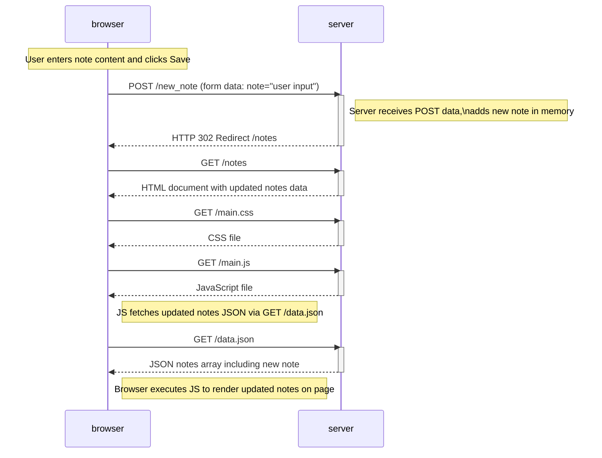

# EXERCISE 0.4
Below is a depiction of what happens when a user creates a new note on the [notes page](https://studies.cs.helsinki.fi/exampleapp/notes), by writing something into the text field and clicking the Save button.

