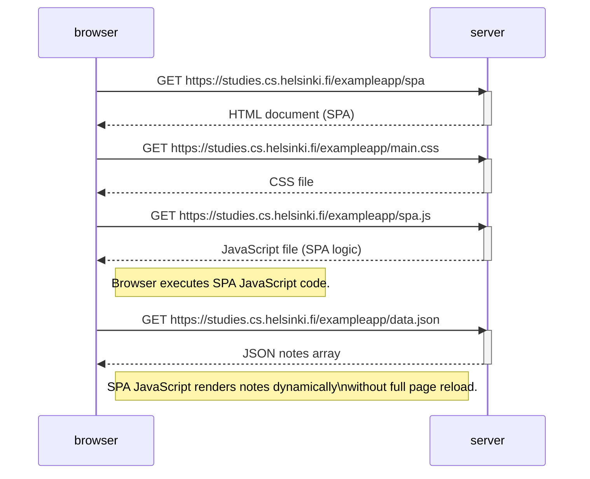

# EXERCISE 0.5
Below is a depiction of what happens when a user goes to the [single-page app (SPA) version of the notes app](https://studies.cs.helsinki.fi/exampleapp/spa):

```mermaid
sequenceDiagram
    participant browser
    participant server

    browser->>server: GET https://studies.cs.helsinki.fi/exampleapp/spa
    activate server
    server-->>browser: HTML document (SPA)
    deactivate server

    browser->>server: GET https://studies.cs.helsinki.fi/exampleapp/main.css
    activate server
    server-->>browser: CSS file
    deactivate server

    browser->>server: GET https://studies.cs.helsinki.fi/exampleapp/spa.js
    activate server
    server-->>browser: JavaScript file (SPA logic)
    deactivate server

    Note right of browser: Browser executes SPA JavaScript code.

    browser->>server: GET https://studies.cs.helsinki.fi/exampleapp/data.json
    activate server
    server-->>browser: JSON notes array
    deactivate server

    Note right of browser: SPA JavaScript renders notes dynamically\nwithout full page reload.
```