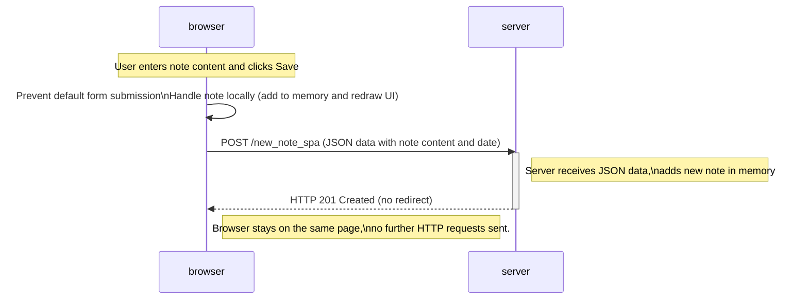

# EXERCISE 0.6
Below is a depiction of what happens when a user creates a new note using the [single-page app version of the notes app](https://studies.cs.helsinki.fi/exampleapp/spa) by writing something into the text field and clicking the Save button.

Explanation:
- The SPA intercepts the form submission to prevent a full page reload.
- The browser adds the new note locally and updates the UI immediately.
- The browser sends a POST request with the new note JSON to the server.
- The server stores the note and responds with a 201 status.
- Unlike traditional apps, the page does not reload and no further HTTP requests occur after submission.

This reflects the core SPA behavior of handling data and UI updates client-side while syncing with the backend asynchronously.